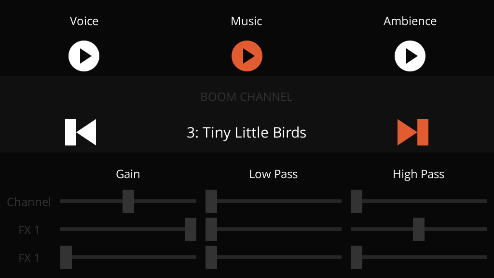

# Boom 💥

Boom is a libGDX audio extension that brings special effects to your game.

Ever wished you could apply effects to your sounds such as reverb and echo, low pass filters, or even distortion with a robotic voice effect? That's what Boom does!

Made exclusively for the **lwjgl3** backend, Boom unleashes the power of OpenAL so you can make use of all its features.

Watch the video to listen to its features:

[](https://youtu.be/GJjAHdrO-5A "Boom Example")

## Contents

- [Features](#features)
    - [Effects](#effects)
    - [Channels](#channels)
    - [Filters](#filters)
- [Limitations](#limitations)
- [Example App](#example-app)
- [Install](#install)
- [Usage](#usage)

## Features

### Effects

Boom has 10 different real-time effects for you to use. All of them have several configuration parameters to be fine tuned, plus a rich documentation for each of them.

- **Auto Wah**
    - Emulates the sound of a wah-wah guitar pedal.
- **Chorus**
    - Creates a "doubling" effect of the audio.
- **Compressor**
    - Evens out the audio dynamic range of a sound.
- **Distortion**
    - Simulates an overdrive effect from a guitar amplifier.
- **Echo**
    - Generates discrete and delayed instances of the audio.
- **Flanger**
    - Creates a "tearing" or "whooshing" sound, like a jet flying overhead.
- **Pitch Shifter**
    - Changes the pitch of the sound without changing its speed / tempo.
- **Reverb**
    - Simulates a reverberation effect with 99 presets for you to choose from.
- **Ring Modulator**
    - Creates a tremolo or inharmonic effect.
- **Vocal Morpher**
    - Imposes vocal tract effects upon the audio.

### Channels

Create channels for you to play sounds through! Imagine you have always had a "channel" on your libGDX game, lets call it the "plain channel". It doesn't have any effects of modifications, the sound just goes through.

With Boom you can create additional channels, like a "World" channel that has a little bit of Reverb and Echo.

You can also have a "UI" channel with a "Chorus" effect on it, so your UI sounds have a stereo feeling.

Perhaps a "Dialogue" channel with a Compressor, exclusive for dialogue sounds. You can even automate the "World" channel filter to muffle all world sounds while there are dialogue sounds being played.

### Filters

Every channel and effect contains a Bandpass Filter, which allows you to control the gain (volume), low pass (remove high frequencies), and high pass (remove low frequencies) or any sound.

```java
// Channel filter
myBoomChannel.getFilter().setLowPass(0.3f);

// Effect filter
BoomEffect reverbEffect=myBoomChannel.addEffect(ReverbPreset.AUDITORIUM);
reverbEffect.getFilter().setGain(0.5f);
reverbEffect.getFilter().setHighPass(0.15f);
```

## Limitations

- Only works with the LWJGL3 backend (desktop).
  - Other backends such as mobile and web are not supported nor planned.
- You must **only** use Boom to play audio.
  - Boom works by applying effects and filters directly to OpenAL, but libGDX doesn't know that. When Sounds and Music are played directly through `Sound.play()` and `Music.play()`, whatever Boom effect is currently active will bleed to them.
  - Just play your audio through the `Boom` class and you'll be fine!
- Boom channels can't have more than 2 effects applied at once. This is a libGDX limitation.

## Example App

You can run the example app to see how the library works. It's also a great way to learn how to use it.

1. Clone this repository.
2. Open terminal at the project's root folder.
3. Run `gradlew example:run` _(If that doesn't work, try `./gradlew` instead)_

**Extra:** You can also run `gradlew example:runEffectExplorer` to open an experimental app which allows you to explore most Boom effects and test their presets and parameters in real time.

## Install

**Step 1.** Add the JitPack repository to your build file

Add it in your root build.gradle at the end of repositories:

```groovy
allprojects {
    repositories {
        ...
        maven { url 'https://jitpack.io' }
    }
}
```

**Step 2.** Add the core dependency to your core module:

```groovy
dependencies {
    implementation 'com.github.rafaskb.boom:core:boomVersionHere'
}
```

**Step 3.** Add the lwjgl3 dependency to your lwjgl3 module:

```groovy
dependencies {
    implementation 'com.github.rafaskb.boom:lwjgl3:boomVersionHere'
}
```

**Step 4.** Pick the appropriate version of Boom:

Replace `boomVersionHere` in the Gradle scripts above with either:

- A Github release tag, such as `1.0.0` (This method is recommended)
- A commit hash, such as `2a683d5`
- The latest changes from the master branch: `master-SNAPSHOT`

See https://jitpack.io/#rafaskb/boom for more detailed instructions.

## Usage

1. Load your Sound and Music files.
2. Initiate Boom in your game's class, ideally in the `create()` method.
3. Create channels and add any effects you want to them.
4. Play your sounds through Boom.

```java
public class MyGame extends Game {
    @Override
    public void create() {
        // Create your sounds
        Sound mySound = Gdx.audio.newSound(Gdx.files.internal("path/to/sound.wav"));

        // Init Boom
        Boom boom = Boom.init();

        // Create a Boom channel
        int channelId = 3;
        BoomChannel myChannel = boom.createChannel(channelId);

        // Add some effects to it
        myChannel.addEffect(ReverbPreset.AUDITORIUM); // Adds a Reverb effect through a preset
        myChannel.addEffect(new EchoData()); // Adds a Echo effect using the default values

        // Change the channel's filter just because you can
        myChannel.getFilter().setLowPass(0.5f); // Remove high frequencies

        // Play your sounds through Boom
        boom.play(mySound, myChannel); // Pass either the BoomChannel object or just its ID
    }
}
```
